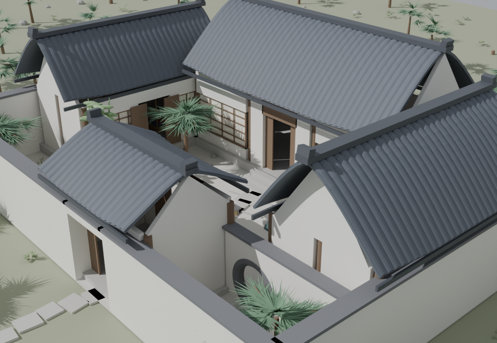
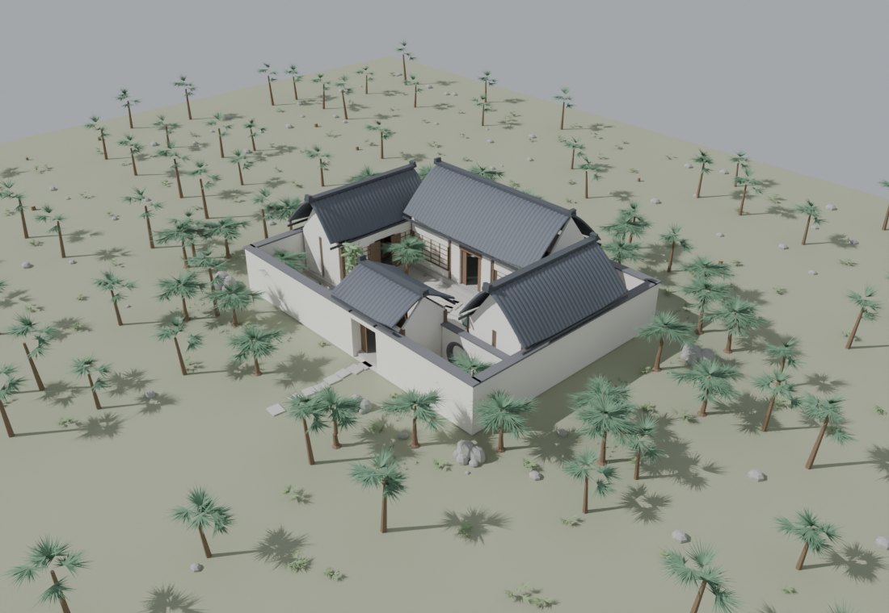
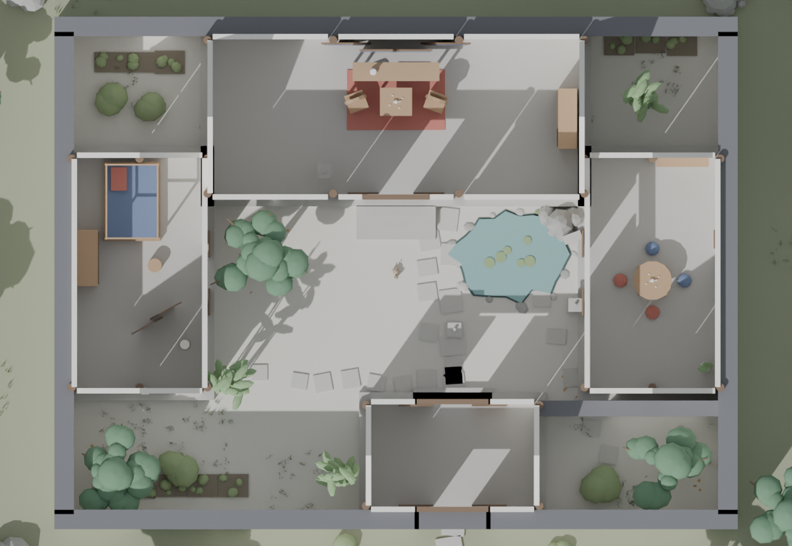
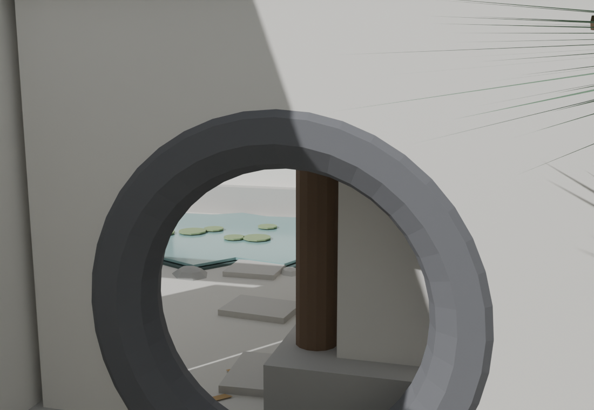
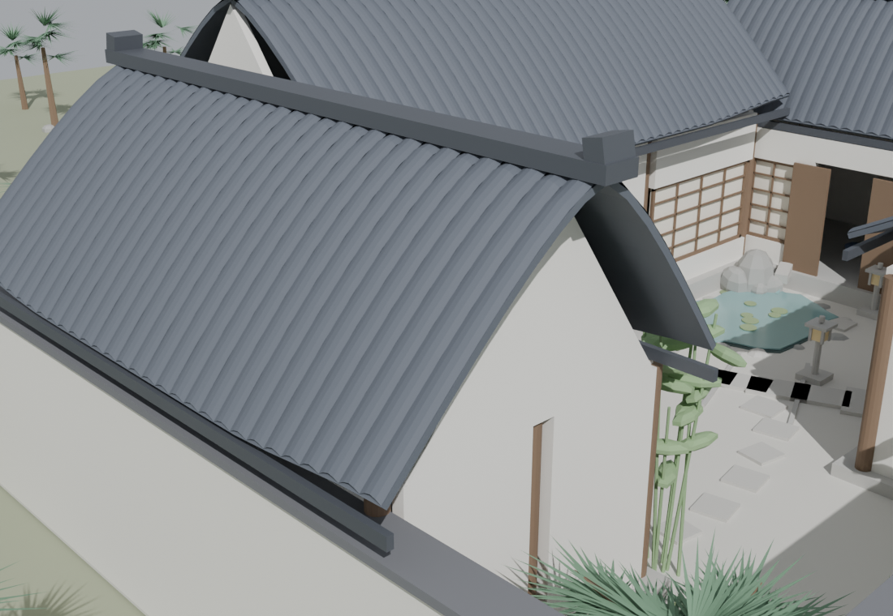

# Chinese Courtyard 庭院

An explorable Chinese courtyard house (siheyuan) in the browser.
Geometry is generated procedurally in **Blender** (headless, via Python) and exported
to **glTF**, then lit, animated and made interactive with **Three.js** —
white walls, dark tiled roofs with lifted corners, a moon gate, pines, a pond with
reflective rippling water, koi, frogs, dragonflies, a cat, sparrows, night
fireflies, wind-blown falling leaves, grass beds and fallen-leaf litter.
Interiors: living room (main hall), tea room (east wing), bedroom (west wing).
Time of day cycles **day → sunset → night** (`N`); the app opens at sunset.



## Screenshots

| | |
|---|---|
|  |  |
| _The compound in its landscape_ | _Roof-hid plan view (press `R`)_ |
|  |  |
| _Through the moon gate toward the pond_ | _Tiled roofs: flush gable ends, wings under the main eave_ |

## Run it

Requirements: any static file server. Node.js is only needed if you want to
re-generate models or re-validate GLBs.

```bash
cd Chinese-Courtyard

# option A — python (no install needed)
python3 -m http.server 8080 --directory web
# option B — npm script (same thing)
npm start
```

Open **http://localhost:8080** in a modern browser (Chrome/Safari/Firefox, WebGL2).

### Run with Docker (recommended for deployment)

The stack ships a staged image: a **validate** stage checks every GLB, then a
hardened **nginx** runtime serves the viewer (correct `model/gltf-binary`
MIME, gzip, cache policies, read-only rootfs, healthcheck).

```bash
# serve on http://localhost:8080
docker compose up -d --build web

# regenerate all GLBs inside a pinned headless-Blender 4.2 container
docker compose --profile pipeline run --rm pipeline
```

| Service | Purpose |
|---|---|
| `web` | nginx static viewer, port 8080, self-healing (`restart: unless-stopped`) |
| `pipeline` | (profile `pipeline`) headless Blender build; writes `models/` + `web/models/` |

## Controls

| Input | Action |
|---|---|
| Drag | Orbit |
| Scroll / pinch | Zoom |
| `W A S D` (or arrows) | Walk (hold `Shift` to run) |
| `N` | Cycle day → sunset → night (lanterns fade in, stars, fireflies) |
| `R` | Hide / show roofs (peek into the rooms) |

UI is two corner buttons (day/night, roof) plus a hint pill that fades out —
it never covers the courtyard.

## Project layout

```
blender/
  lib/common.py         primitives, materials, parametric curved roof, booleans, UVs
  lib/architecture.py   halls, wings, gatehouse, enclosure + moon-gate wall
  lib/garden.py         pond, rockery, pines, bamboo, lanterns, paths, plantings,
                        grass, fallen-leaf litter, spout stream, terrain + woods
  lib/interior.py       living room / tea room / bedroom furniture
  lib/critters.py       koi, frog, dragonfly, cat, sparrow (per-animal GLBs)
  build.py              entry: builds a stage, exports GLBs, renders check PNGs
models/                 exported GLBs (source of truth)
web/                    deployable web app (self-contained: vendor/ + models/ + src/)
check/                  headless Cycles preview renders used to verify each stage
docs/screenshots/       renders embedded in this README
tools/check-glb.js      GLB sanity checker (header, chunks, accessors, materials)
web/Dockerfile          staged image: GLB validation → nginx runtime
web/nginx.conf          hardened static server config (MIME, gzip, caching)
pipeline/Dockerfile     pinned headless-Blender image that regenerates the GLBs
docker-compose.yml      web service + optional `pipeline` profile
```

## Rebuild the models

[Blender](https://www.blender.org/) 4.x/5.x must be installed (on macOS:
`/Applications/Blender.app`). Each stage builds cumulatively and writes both
`models/` and `web/models/`, plus verification renders to `check/`:

```bash
# full rebuild (architecture + garden + interiors + critters) with renders
blender -b -P blender/build.py -- --stage 5

# architecture only, no renders
blender -b -P blender/build.py -- --stage 1 --no-render

# validate exported GLBs
npm run check-glb
```

Stages: `1` architecture · `2` +garden · `3` +interiors · `5` +critters.
Critter GLBs are exported individually (`critter_*.glb`) because the browser
clones and animates them per-instance.

## How it works

- **Blender side** — everything is generated from parameters (no imported assets):
  roofs are a parametric concave surface with corner lift (`make_roof`), the moon
  gate is a cylinder boolean minus a wall, lattice windows are procedurally
  framed. Materials use a fixed palette (`common.py`); names (`RoofTile`,
  `PaperWarm`, `LanternGlow`, …) are the contract with the browser.
- **Browser side** — `web/src/main.js` loads the GLBs, adds canvas-generated
  roof-tile / paving textures, and drives day/night, roof fade and controls.
  The pond's `PondWater` mesh is replaced by a custom **Reflector** whose shader
  adds animated ripple distortion (plus a spout ripple ring), fresnel mixing and
  transparency so the koi stay visible. `web/src/life.js` clones the five critter
  prototypes and animates them with deliberately subtle motion: koi wander inside
  the pond ellipse, frogs hop occasionally (never into the water), dragonflies
  hover and dart, the cat sits, glances and strolls between spots, sparrows hop,
  peck and make short flights, and fireflies pulse only at night.
- **Coordinates** — Blender is Z-up, Three.js is Y-up; the glTF exporter handles
  the axis swap, and plan coordinates map as `(x, y, z) → (x, z, -y)`.

## Notes

- No build step, no CDN, no network: `web/` is fully self-contained
  (Three.js is vendored in `web/vendor/` with an import map).
- Animals are kept deliberately understated so they never steal the scene;
  the courtyard is human-scaled (18 × 13.5 m enclosure, 2.6 m walls).
